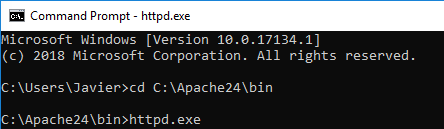

### Installing Apache

One of the [recommended](https://httpd.apache.org/docs/current/platform/windows.html#down) sites to download Apache for windows is [Apache Lounge](http://www.apachelounge.com/download/).
The last available version at the time of writing this guide is `2.4.38`. 
After downloading the [zip file](https://home.apache.org/~steffenal/VC15/binaries/httpd-2.4.38-win64-VC15.zip), extract the content of the zip file at `C:/Apache24`. The folder should look like this:


1. Apache on Windows requires `Microsoft Visual C++ 2017 Redistributable` to be installed on the machine. Go and get the installation file at [this location](https://aka.ms/vs/15/release/VC_redist.x64.exe).


2. Open a Command Prompt window, navigate to `C:\Apache24\bin` and execute the `httpd.exe` executable:



3. If Windows Defender Firewall ask for network access, click in Allow Access:


3. If the installation was sucessfull, you should be able to see Apache's default site. To do so, open a browser and navigate to [http://localhost](http://localhost):


#### Adding virtual hosts

The main Apache configuration file is located at `C:\Apache24\conf\httpd.conf` but in order to add a virtual host, the recommended file to modify is `C:\Apache24\conf\extra\httpd-vhosts.conf` as this only contains the settings regarding virtual hosts.

1. Stop Apache server

Stop the command `httpd.exe` running in the Command Prompt in previous steps. To do this hit `Ctrl+C` twice and wait some seconds until the prompt shows up.

2. Include vhost file line 509 in main configuration file

Open the `http.conf` file and remove the `#` symbol at the beginning of line 509, the result should be:

```Include conf/extra/httpd-vhosts.conf```


3. Create the VirtualHost entries

Open the `httpd-vhosts.conf` file located at `C:\Apache24\conf\extra\httpd-vhosts.conf` and modify the content with the following:

```apache
<VirtualHost *:80>
   DocumentRoot "C:/Apache24/htdocs/dummy-host"
   ServerName dummy-host.example.com
</VirtualHost>

Listen 90
<VirtualHost *:90>
   DocumentRoot "C:/Apache24/htdocs/dummy-host2"
   ServerName dummy-host2
</VirtualHost>
```

4. Add entry in hosts file

With notepad in Administrator Mode, open the file `C:\Windows\System32\drivers\etc\hosts` and add `127.0.0.1   dummy-host.example.com` as new line and save the file. The content should be something like:


5. Include virtual host files

Create the content for the virtual hosts. For dummy-host, create an html file at `C:\Apache24\htdocs\dummy-host\index.html` with the following content:

```html
<html>
   <body>
      <h1>Hi from virtual host 1</h1>
   </body>
<html>
```

For dummy-host2, create an html file at `C:\Apache24\htdocs\dummy-host2\index.html` with the following content:

```html
<html>
   <body>
      <h1>Hello from virtual host 2!</h1>
   </body>
<html>
```

6. Run the Apache service again

In the Command Promt run the `httpd.exe` program

7. Navigate the virtual hosts

Open a web browser and go to `http://dummy-host.example.com/`, a web site like the following will be shown:


Open another web browser and go to `http://localhost:90/`, a web site will be shown:


