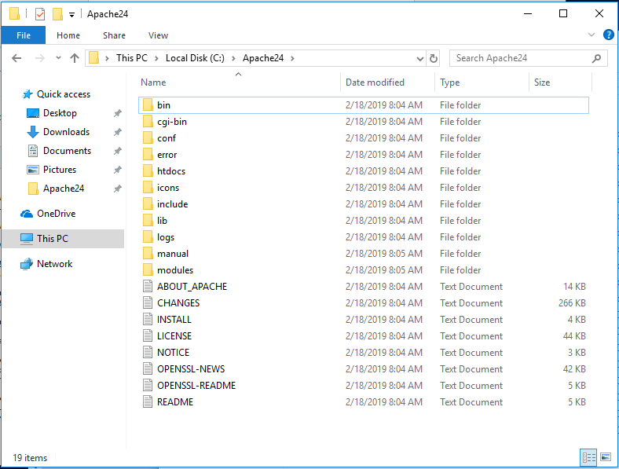
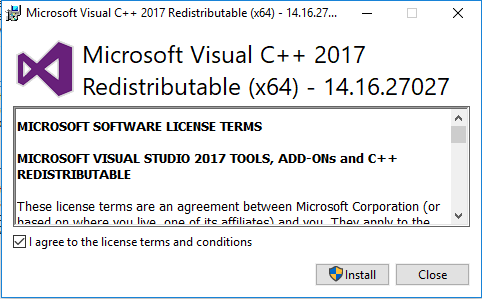
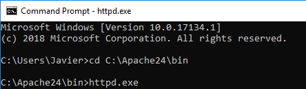
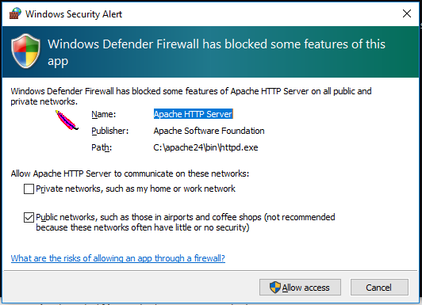

# Windows 10 Web Server Development Enviroment Setup

This guide provides a set of installation instructions on how to setup a developer enviroment on a brand new Windows 10 64-bits workstation.

# Apache Installation

### Installing Apache

One of the [recommended](https://httpd.apache.org/docs/current/platform/windows.html#down) sites to download Apache for windows is [Apache Lounge](http://www.apachelounge.com/download/).
The last available version at the time of writing this guide is `2.4.38`. 
After downloading the [zip file](https://home.apache.org/~steffenal/VC15/binaries/httpd-2.4.38-win64-VC15.zip), extract the content of the zip file at `C:/Apache24`. The folder should look like this:

Apache on Windows requires `Microsoft Visual C++ 2017 Redistributable` to be installed on the machine. Go and get the installation file at [this location](https://aka.ms/vs/15/release/VC_redist.x64.exe).

Open a Command Prompt window, navigate to `C:\Apache24\bin` and execute the `httpd.exe` executable:

If Windows Defender Firewall ask for network access, click in Allow Access:

#### Adding virtual hosts

# PHP Installation

# MySQL Community Server Installation

# PhpMyAdmin Installation

# IIS Installation

# ASP.net Installation
