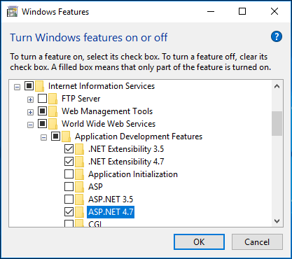
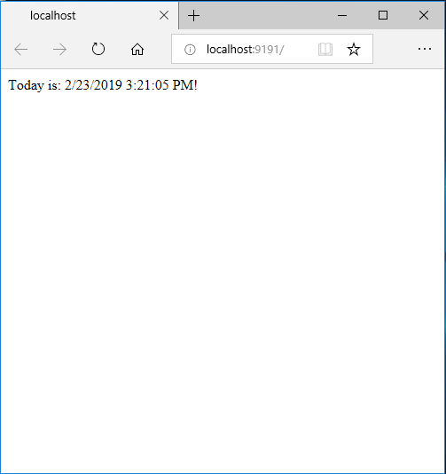

### ASP.net installation

In order to run ASP.net sites in windows, you should have IIS installed, to do so follow the [IIS installation guide](iis.md). Once you have installed IIS, continue with the following steps:

1. Adding the feature to windows

   Open again the Turn Windows features on or off window.

2. Select the ASP.Net feature

   In the list of features to activate, expand the `Internet Information Services` node, then expand `World Wide Web Services` and next expand the `Application Development Features` node.
   Check the `ASP.NET 4.7`. Your selection should look like this:

   

   Click the Ok button to continue. If asked for permission to download files, allow it to continue the installation.

4. Browse an ASP.NET website

   If you followed the [IIS installation guide](iis.md), you may have created a dynamic site at the end. You can navigate to that site in your browser entering http://localhost:9191 which will give show you something like:

   

   If you refresh the browser you could see that the page content changes depending on the time it is accessed.
