### IIS Installation

Installing IIS in Windows 10 does not require any download. The installation process is done by activating features on Windows:

1. Open Turn Windows features on or off

   * Open Control Panel
   * Go to Programs
   * Click Turn Windows features on or off to open the following window:

   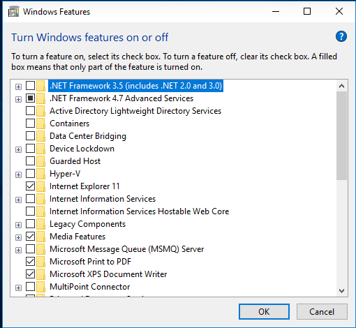

2. Install Internet Information Services

   In the list of features to activate, click in the checkbox next to `Internet Information Services`.
   Expand the `Internet Information Services` by clicking the plus symbol on the left. Also expand the `Web Management Tools` node and then the `IIS 6 Management Compatibility` node.
   Check the `IIS 6 Management Console`. Your selection should look like this:

   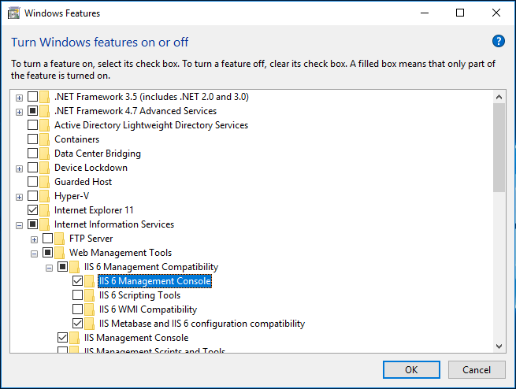

   Click the Ok button to continue.
   
3. Reboot the PC

   After Windows finished applying the changes, it will require you to restart the PC:

   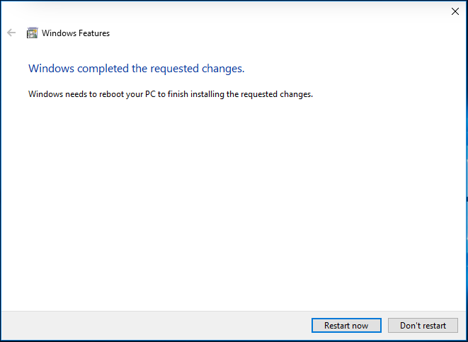

4. Open IIS Manager

   Once the computer has restarted, open `Internet Information Services (IIS) Manager`, this is the window where you can manage all the settings for IIS websites:

   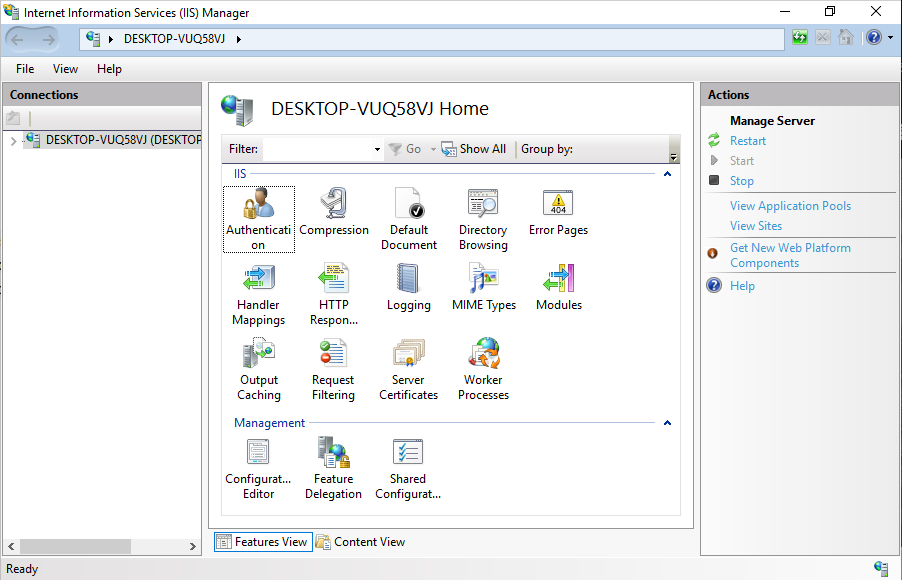


5. Navigate to localhost

   Open a web browser and enter the url http://localhost, you will look a page like the following indicating that the process was successful:

   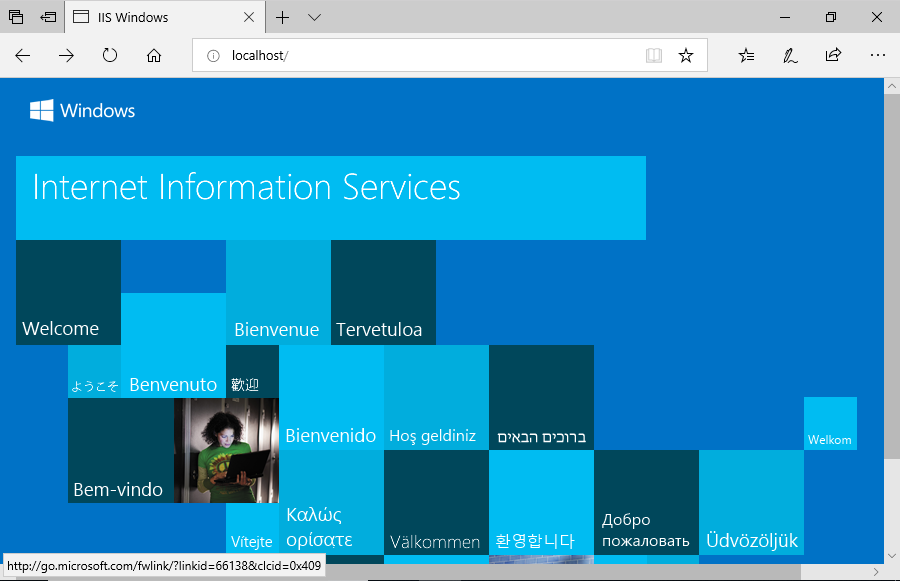

#### Adding static websites

1. Create the folder

   The default path to place sites for IIS to serve is `C:\inetpub\wwwroot`. Create a folder name site1 inside that folder. Then create the file `C:\inetpub\wwwroot\site1\index.html` with the following content:
   
   ```html
   <!DOCTYPE html>
   <html>
   <head>
      <title>Site 1</title>
   </head>
   <body>
      Site 1 content
   </body>
   </html>
   ```

2. Create the website on IIS

   In the `Internet Information Services (IIS) Manager` window, expand the server node in the `Connections` panel on the left, right click the `Sites` folder and click on `Add Website...`:

   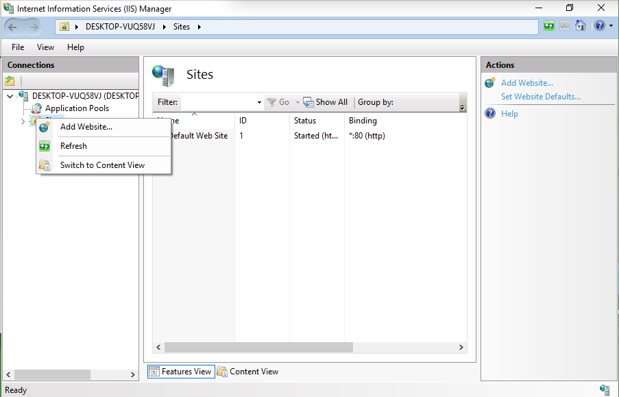

   In the `Add Website` dialog window, type `site1` for Site name, `C:\inetpub\wwwroot\site1` for Physical path and `9090` for Port:

   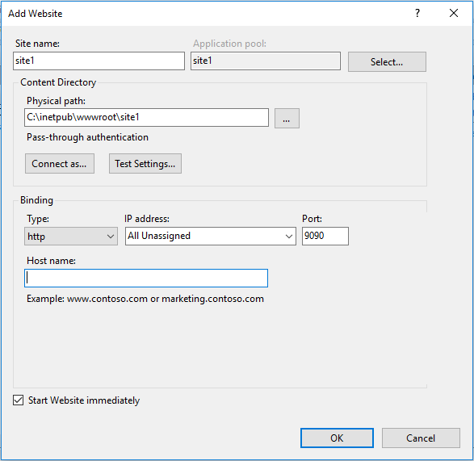

   Click Ok to continue.

   Once the site is created, you can see the site on the `Sites` section on the center of the screen:

   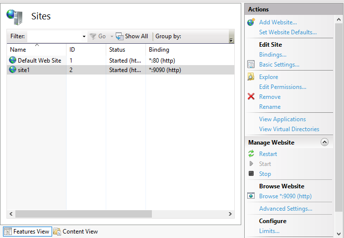

3. Browse your new site

   Select `site1` on the Sites list and click `Browse *:9090 (http)` or open your browser and enter the url http://localhost:9090, you will see the new site:

   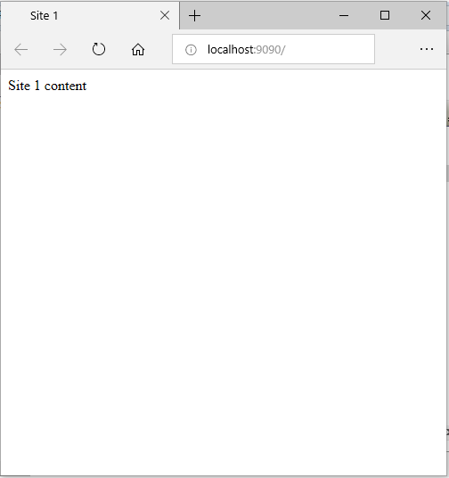

#### Adding an ASP website

To generate a dynamic web site using ASP you will follow the same instructions as before, but the file name is `default.aspx` instead of `index.html`

1. Create the folder
   
   Inside the `C:\inetpub\wwwroot` folder create the following file `C:\inetpub\wwwroot\site2\default.aspx` with the following content:

   ```aspx
   <!DOCTYPE html>
   <html>
   <body>
      Today is: <%= DateTime.Now.ToString()%>!
   </body>
   </html>
   ```

2. Add the web site

   Open the `Add Website` dialog window, and type `site2` for Site name, `C:\inetpub\wwwroot\site2` for Physical path and `9191` for Port:
    
   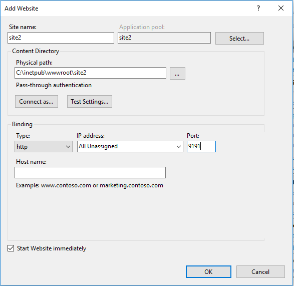

   Click Ok to continue.

3. Browse your new site

   If you open your browser at http://localhost:9191, you will see an error like this:

   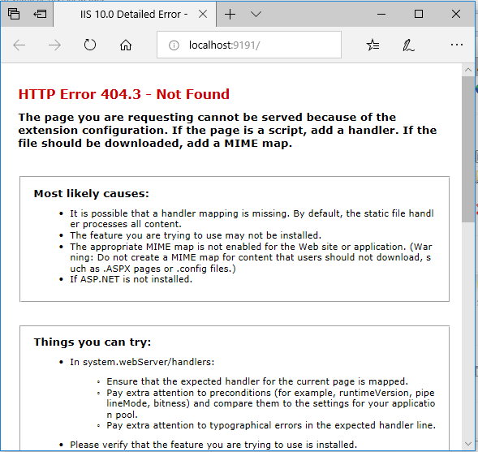

   That is an expected error as we have not installed ASP yet, the installation guide for ASP is the [next guide](asp.md).

   
