# MySQL Community Server Installation

For getting the latest MySQL installer go to the [Official page](https://dev.mysql.com/downloads/windows/installer/8.0.html) and get the [offline installation package](https://dev.mysql.com/get/Downloads/MySQLInstaller/mysql-installer-community-8.0.15.0.msi). 
If asked for login or sign up, keep scrolling down, there will be a direct link to the installation file.

1. Run the installation 

Once downloaded the file, run it. It will prompt for permissions before starting the installation:

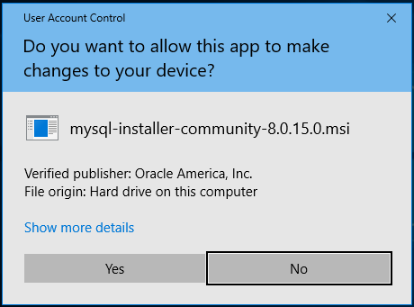

Click on yes, to start the installation process.

2. Read and Accept the License Agreement

In the MySQL Installer window, and after reading the License Terms, click the `I accept the license terms` checkbox and click Next.

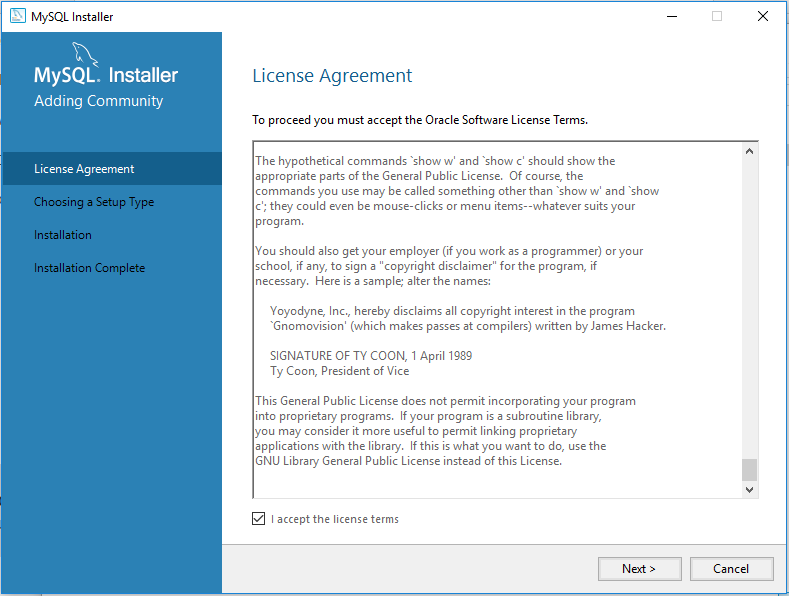

3. Choosing a Setup Type

There are multiple installation types of MySQL. To be able to choose which components to install, select `Custom` and click Next:

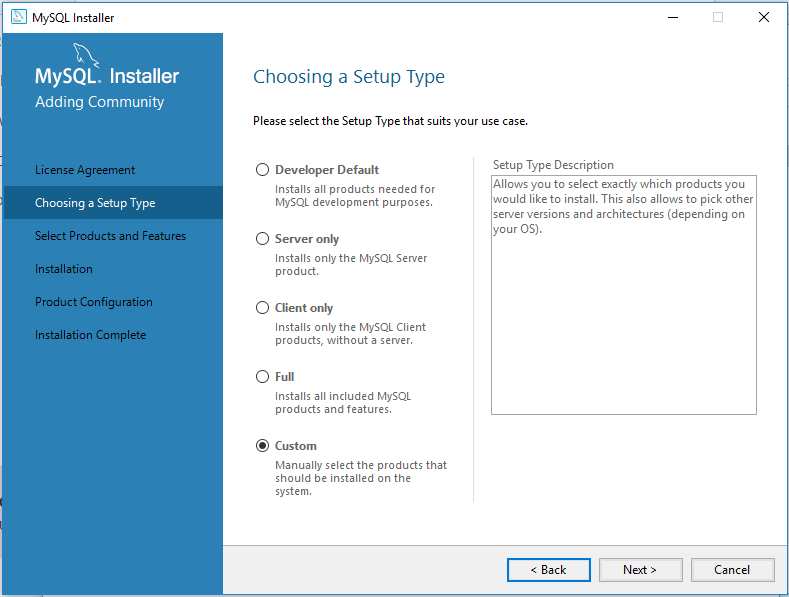

4. Select Products and Features

There are two panels showing the Available Products (left) and the Products/Features to be installed (right).
Using the controls provided between the panels, keep only the following components in the right panel:
   - MySQL Server 8.0.15 - X64
   - MySQL Workbench 8.0.15 - X64
   - Connector/ODBC 8.0.15 - X64
   - Connector/NET 8.0.15 - X64
   - MySQL Shell 8.0.15 - X64

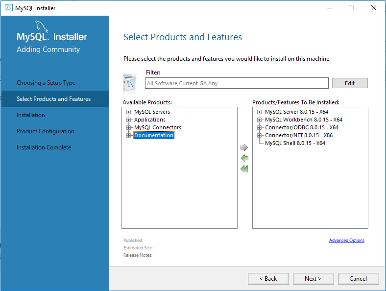

Click Next and then Execute to start the installation process.
Once all the products show a Complete status, click Next:

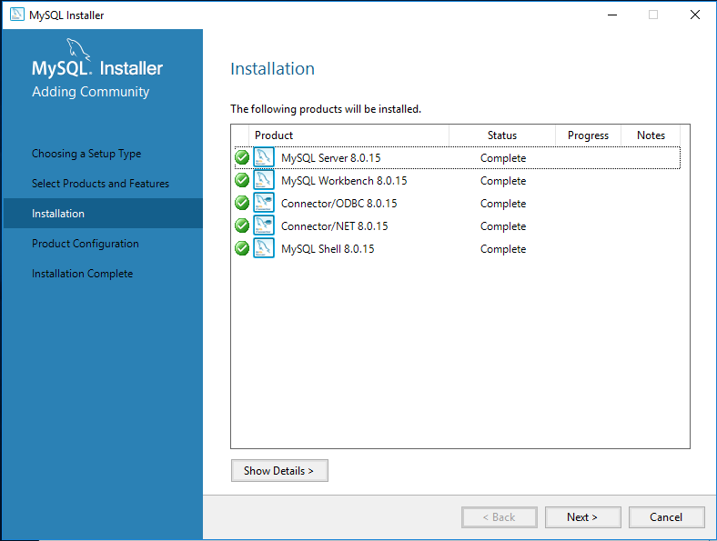

5. Group Replication Settings

If asked for Group Replication, keep the default selected setting and click Next.

6. Type and Networking

Keep the default Config Type as `Development Computer`. Make sure the TCP/IP port used is 3306, click Next:

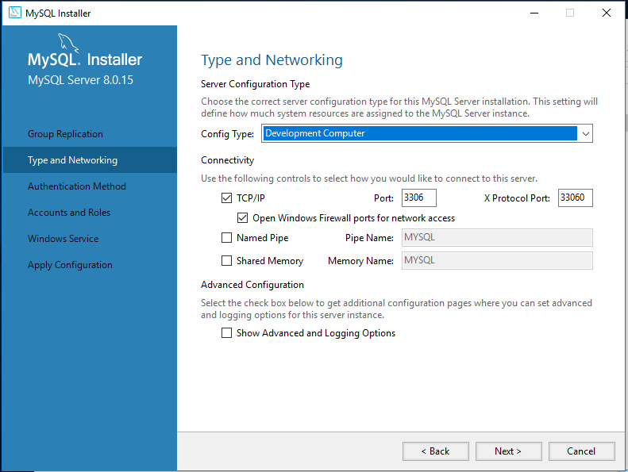

7. Authentication Method

The `8.0.15` version of MySQL Server comes with new authentication methods that can generate problems when trying to use phpmyadmin. As these installation guides include the installation of phpmyadmin, we are going to select the `Use Legacy Authentication Method` that gives us the backward compatibility require to connect using phpmyadmin.

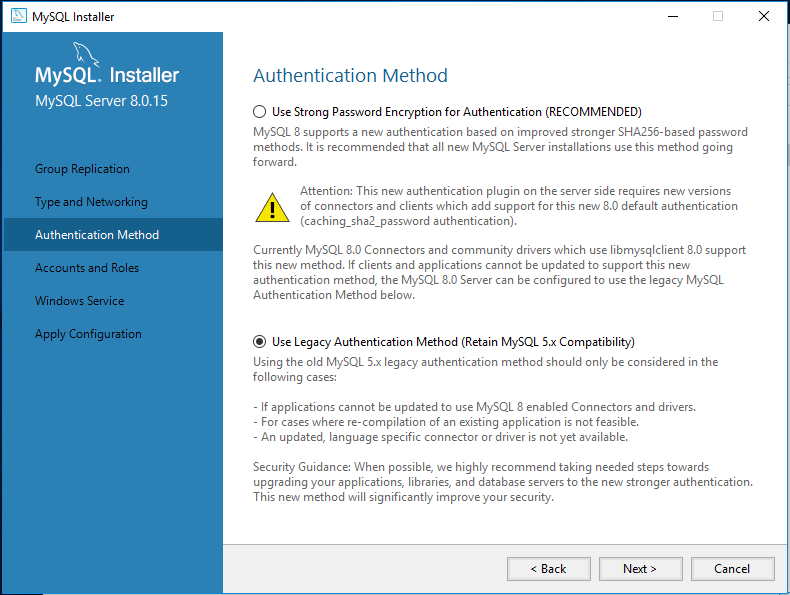

Click Next to continue.

8. Password

In the Account and Roles configuration window, type the password for root user:

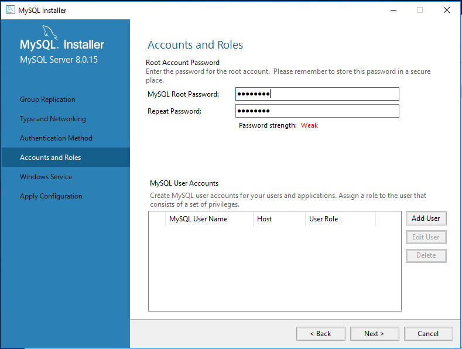

If required, add extra user accounts in the section MySQL User Accounts section.
When completed, click Next.

9. Window Service

Review the configuration to install MySQL Server as a Windows Service and click Next.

10. Apply Configuration

In the Apply Configuration window click Execute to start the configuration process.

Click Finish to complete the installation:

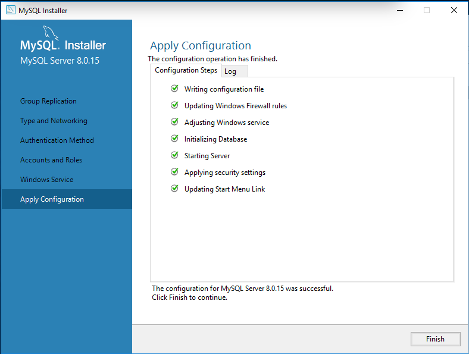

11. Testing MySQL Server

To test connectivity, open MySQL Workbench and click in `Local instance MySQL809` under MySQL Connections.

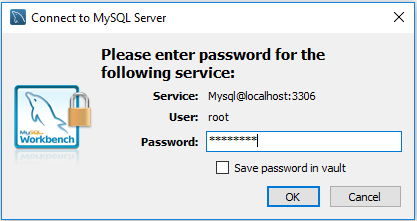

Type in the password used in step 8, and click Ok.

You will be able to work on your new MySQL Server instance:

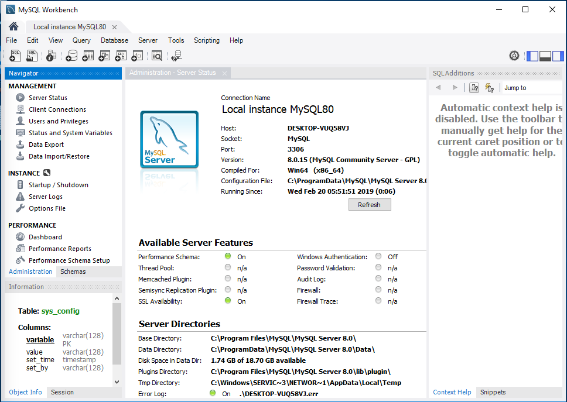

