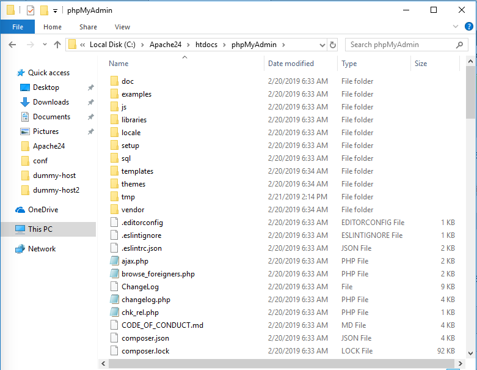
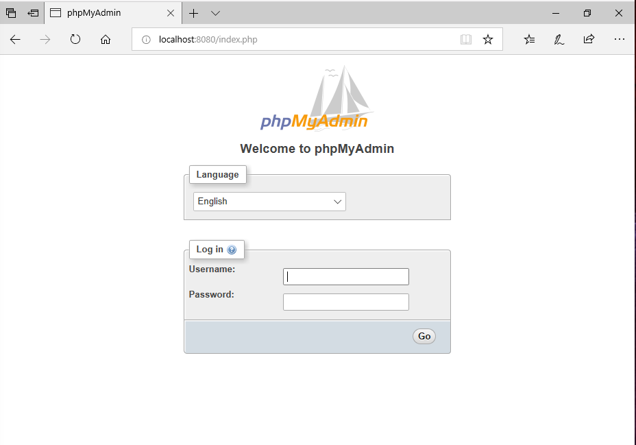

# PhpMyAdmin installation

The latest version of PhpMyAdmin at the time of writing this guide, according to its [official web site](https://www.phpmyadmin.net/), is `4.8.5`.

1. Download zip file.

Go and get the [zip file for windows](https://files.phpmyadmin.net/phpMyAdmin/4.8.5/phpMyAdmin-4.8.5-all-languages.zip) and extract the content in a new folder called `phpMyAdmin` inside the htdocs folder for apache: `C:\Apache24\htdocs\phpMyAdmin`. Your folder should look like the following:



2. Create the configuration file

The installation package comes with a sample file for you to use, rename `config.sample.inc.php` to `config.inc.php`

3. Set the cookie based authentication

Edit the `config.inc.php` file to set the `blowfish_secret` configuration. The new value should have a 32-chars-long random generated value that will be use to encrypt password in cookies.
In line number 17, set the new value like so:

```php
$cfg['blowfish_secret'] = 'ljgeyfsw3458grsiu&420&6f@duilF1!';
```

4. Create a virtual host in Apache

To create a virtual host for phpMyAdmin in Apache, edit the vhosts configuration file `C:\Apache24\conf\extra\httpd-vhosts.conf` to include a new virtual host:

```Apache
Listen 8080
<VirtualHost *:8080>
    DocumentRoot "${SRVROOT}/htdocs/phpMyAdmin"
    ServerName phpMyAdmin
</VirtualHost>
```

5. Enable mysqli php extension

PhpMyAdmin uses a php extension to connect to MySQL, which is disabled by default. Open the `C:\php\php.ini` file and add the following line at the end of the file to enable the extension:

```php
extension=mysqli
````

6. Access PhpMyAdmin

Open a web browser and navigate to http://localhost:8080, you will see a page where you can enter the credentials to connect to MySQL server:


