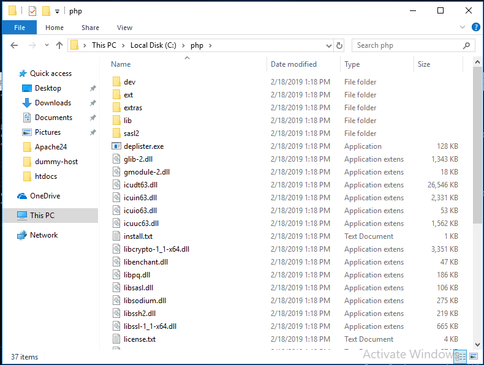
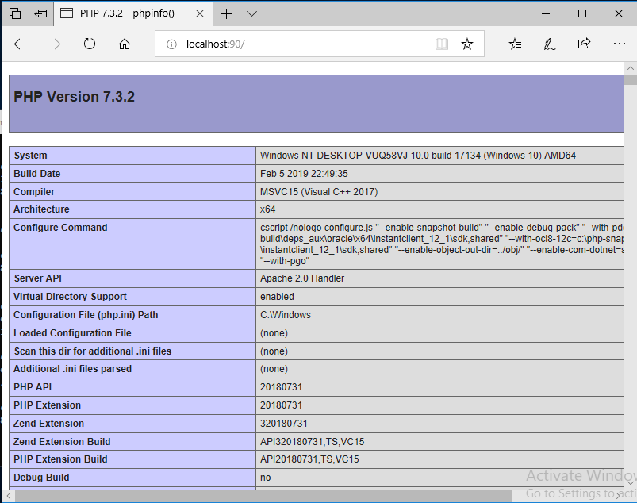

### PHP Installation

This installation guide will required the configuration created with the [Apache installation guide](Apache.md) in order to set up php manually.

1. Get the zip file

To get the PHP installation package, go to https://windows.php.net/download/ and get the [zip file](https://windows.php.net/downloads/releases/php-7.3.2-Win32-VC15-x64.zip). Extract the files at `C:\php\`, the folder should look like:



2. Rename php.ini file

The default installation package comes with two samples of the `php.ini` file: `php.ini-development` and `php.ini-production`. As this installation targets a development environment we need former version of the file.

Rename the file `php.ini-development` to `php.ini`

3. Apache configuration

Using the apache configuration file created in the [Apache installation guide](Apache.md), include the following lines at the end of the `c:\Apache24\conf\httpd.conf` file:

```apache
DirectoryIndex index.php index.html

LoadModule php7_module "C:/php/php7apache2_4.dll"
AddType application/x-httpd-php .php
PHPIniDir "C:/php"
```

4. Testing php site

Using the dummy-host2 virtual host located at `C:\Apache24\htdocs\dummy-host2`, replace the `index.html` file with `index.php` and the following content:

```php
<?php

phpinfo();

?>
```

5. Go live

Open your browser at http://localhost:90/ you will see a php sample running:


